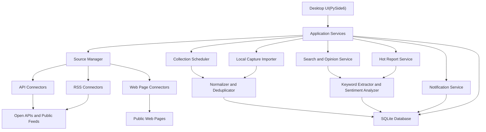
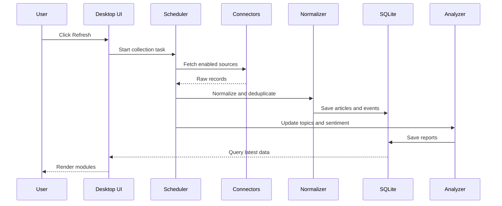
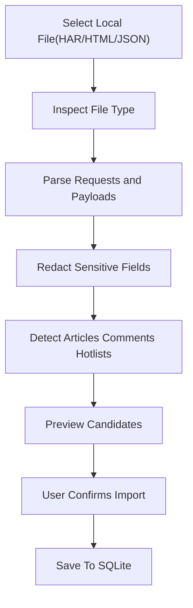

# News Intelligence Desktop

Feature Name: news-intelligence-desktop
Updated: 2026-05-27

## Description

本设计文档描述一个 Python 本地个人每日信息中枢和 API 工具箱。系统首页聚焦“今天发生了什么”，展示技术变化、新闻、政策、热点、本地事件、天气地震、网络安全和每日语录；API 工具箱通过独立按钮进入，用于检索、启用和测试公共 API。程序以公开 API、RSS Feed、公开网页和用户手动导入的本地文件作为采集边界，使用本地 SQLite 存储数据，并为后续 Windows exe 打包预留结构。

推荐技术栈：Python 3.11+、PySide6 桌面界面、httpx 网络请求、feedparser 解析 RSS、selectolax 或 BeautifulSoup 解析网页、haralyzer 解析 HAR 文件、SQLAlchemy 或 sqlite3 存储、APScheduler 定时任务、jieba 或 pkuseg 中文分词、scikit-learn 或 SnowNLP 做轻量情绪分析、plyer 或 win10toast 做桌面通知、PyInstaller 打包。

## Recommended Open Data Sources

| 模块 | 推荐来源 | 接入方式 | 说明 |
| --- | --- | --- | --- |
| 天气预报 | Open-Meteo | REST API | 免费天气 API，支持坐标、逐小时和多日预报。 |
| 地震动态 | USGS Earthquake Catalog / GeoJSON Feeds | REST API / GeoJSON | 提供全球地震事件、震级、位置、深度和时间。 |
| 国际新闻 | GDELT 2.1 DOC API | REST API | 可按关键词、语言、国家和时间检索全球新闻。 |
| 国际新闻 | NewsAPI、GNews、Currents API | REST API | 多数需要 API Key，免费额度适合个人开发验证。 |
| 国内新闻 | 媒体公开 RSS、新闻站点 RSS、公开 API | RSS / REST API | 优先使用 RSS 和开放 API，避免依赖私有热榜接口。 |
| 热点主题 | GDELT、RSS 聚合、本地标题聚类 | REST API / RSS / 本地分析 | 基于多来源标题与摘要生成趋势报告。 |
| 评论线索 | 支持评论摘要的开放 API、RSS、用户配置源 | REST API / RSS | 展示公开评论摘要和链接，保留来源与时间。 |
| 第三方网页 | 用户配置的公开网页 | HTML | 支持 CSS Selector、XPath 和正文自动提取。 |
| 抓包导入 | 用户手动导出的 HAR、HTML、JSON | Local File | 本地解析请求响应和候选内容，敏感字段脱敏后展示。 |
| 政策信息 | 政府官网、政策公开 RSS、官方微信公众号公开页、权威媒体政策频道 | RSS / HTML / REST API | 覆盖全国、省、市、区县和行业政策。 |
| 金融资讯 | 财经媒体 RSS、交易所公告、央行和监管部门公开信息 | RSS / HTML / REST API | 覆盖宏观、资本市场、公司公告和监管动态。 |
| IT 与互联网 | 技术媒体 RSS、厂商博客、开源项目公告、互联网新闻源 | RSS / HTML / REST API | 覆盖技术、产品、平台、企业动态。 |
| 娱乐资讯 | 娱乐媒体 RSS、公开新闻源 | RSS / HTML / REST API | 覆盖影视、明星、综艺、争议事件。 |
| 本地事故与安全 | 应急管理、交警、消防、气象、权威媒体地方频道 | RSS / HTML / REST API | 覆盖车祸、事故、安全宣传和本地突发。 |
| 网络安全资讯 | CNNVD、CNCERT、厂商安全公告、安全博客、行业媒体 | RSS / HTML / REST API | 覆盖漏洞通告、数据泄露、安全事件和行业动态。 |
| 每日语录 | 韩小韩 API、枫雨 API、本地语录库、一言类公开 API | REST / Local | 展示鼓励、轻松、幽默、技术人专属语录。 |
| 技术变化 | GitHub Trending、厂商博客、开源发布、技术媒体 RSS、安全公告 | RSS / REST / HTML | 覆盖 AI、开源、框架、云服务、安全和产品更新。 |

### Source Priority Strategy

系统内置来源按维护成本、稳定性和接入门槛分为三层。

| 层级 | 说明 | 默认策略 |
| --- | --- | --- |
| Tier 1 | 无需 key、官方公开 API、RSS、稳定公开源 | 默认启用 |
| Tier 2 | 注册免费 key、免费额度充足、文档清晰 | 用户配置 key 后启用 |
| Tier 3 | 普通公开网页、热榜页面、搜索结果页 | 用户显式开启，限频采集，规则测试通过后启用 |

### Default Source Pack

| 模块 | 默认来源 | 层级 | 接入方式 | 说明 |
| --- | --- | --- | --- | --- |
| 天气 | wttr.in | Tier 1 | REST | 无需 key，适合快速展示当前天气和简要预报。 |
| 天气 | Open-Meteo | Tier 1 | REST | 无需 key，适合逐小时和多日预报。 |
| 地震 | USGS Earthquake API | Tier 1 | REST / GeoJSON | 全球地震事件，稳定免费。 |
| 地震 | 中国地震台网 RSS | Tier 1 | RSS | 国内地震速报和地震新闻。 |
| 热搜 | 韩小韩 API | Tier 1 | REST | 聚合热搜，免费无 key，作为热搜主力来源。 |
| 新闻 | RSS 订阅源 | Tier 1 | RSS | IT之家、36氪、澎湃、观察者网等公开 RSS。 |
| 猎奇 | 韩小韩 API | Tier 1 | REST | 聚合奇闻、段子等轻量内容。 |
| 地震补充 | 中国地震台网速报官方微博公开页 | Tier 3 | HTML | 作为用户显式开启的补充来源。 |

### Optional Free-Key Source Pack

| 模块 | 可选来源 | 层级 | 接入方式 | 启用条件 |
| --- | --- | --- | --- | --- |
| 天气 | tianqiapi.com | Tier 2 | REST | 用户配置免费账号或 key。 |
| 天气 | 和风天气 | Tier 2 | REST | 用户配置免费 key。 |
| 聚合 API | 天行数据 | Tier 2 | REST | 用户配置免费 key 和接口额度。 |
| 聚合 API | 聚合数据 | Tier 2 | REST | 用户配置免费 key 和接口额度。 |

### User-Enabled Public Web Source Pack

| 模块 | 可选来源 | 层级 | 接入方式 | 说明 |
| --- | --- | --- | --- | --- |
| 天气 | 中国天气网公开页 | Tier 3 | HTML / RSS | 作为权威天气补充来源。 |
| 热搜 | 百度热搜 | Tier 3 | HTML / RSS | 作为热搜补充来源。 |
| 热搜 | 知乎热榜 | Tier 3 | HTML / Public API | 作为热榜补充来源。 |
| 热搜 | 抖音热榜 | Tier 3 | HTML | 作为用户开启的热榜来源。 |
| 热搜 | 头条热榜 | Tier 3 | HTML | 作为用户开启的热榜来源。 |
| 新闻搜索 | 搜狗新闻搜索 | Tier 3 | HTML | 用于关键词新闻搜索补充。 |
| 新闻 | 腾讯新闻公开源 | Tier 3 | HTML / REST | 可参考已有 `tencent-news-cli` 的公开源适配方式。 |
| 猎奇 | 搜狐奇闻公开页 | Tier 3 | HTML / RSS | 猎奇内容补充来源。 |
| 社会新闻 | 新浪社会公开页 | Tier 3 | HTML / RSS | 社会和事故类资讯补充来源。 |

### Aggregation API Candidates

| 平台 | 层级 | 说明 |
| --- | --- | --- |
| 韩小韩 API `api.vvhan.com` | Tier 1 | 热搜、天气、奇闻、笑话等，免费无 key，优先接入。 |
| 彩虹 API / 一为 API `api.aa1.cn` | Tier 1 / Tier 3 | 免费聚合接口，按接口稳定性逐个启用。 |
| 枫雨 API `api-v2.yuafeng.cn` | Tier 2 | 聚合热榜、腾讯新闻热搜、文本审核、百科、历史、黄金价格、IP 归属地等，配置 key 后启用。 |
| 天行数据 `tianapi.com` | Tier 2 | 注册送免费额度，适合政策、新闻和生活类增强接口。 |
| 聚合数据 `juhe.cn` | Tier 2 | 老牌聚合平台，适合作为增强来源。 |

### Yuafeng API Adapter Plan

枫雨 API 作为可选聚合平台和工具箱来源接入。系统使用用户配置的 `apikey` 调用接口，并将不同接口的返回结果统一转换为 `RawArticle`、`HotTopic`、`ModerationResult`、`ReferenceItem`、`MarketQuote`、`ToolResult` 或 `MediaResult`。

| 能力 | 接口 | Endpoint | 参数 | 映射用途 |
| --- | --- | --- | --- | --- |
| 今日热门 | 今日热门 | `/API/jinri_hot.php` | `apikey`、`action`、`page` | 热搜、今日概览、热点推送 |
| 腾讯新闻热搜 | tx新闻热搜 | `/API/txxw.php` | `apikey`、`page`、`type` | 新闻热搜、娱乐、社会、互联网频道补充 |
| 文本审核 | AI文本审核 | `/API/aiwenben.php` | `apikey`、`text` | 本地展示前的敏感等级提示和内容标签辅助 |
| 违禁词检测 | 违禁词检测 | 待接口详情确认 | `apikey`、`text` | 标题和摘要风险提示辅助 |
| 百科搜索 | 百度百科词条搜索 | 待接口详情确认 | `apikey`、关键词 | 热点人物、事件、组织背景补充 |
| 历史今天 | 历史上的今天 | 待接口详情确认 | `apikey`、日期 | 今日概览的轻量扩展卡片 |
| 黄金价格 | 实时黄金多品牌价格 | 待接口详情确认 | `apikey` | 金融频道补充 |
| IP 归属地 | IP归属地查询 | 待接口详情确认 | `apikey`、IP | 来源诊断和网络信息工具 |

#### Supported Hot Actions

`/API/jinri_hot.php` 的 `action` 参数支持：知乎热榜、微博热榜、微信热文榜、澎湃热榜、百度热点、知乎日报、今日头条热榜、梨视频总榜。

#### Yuafeng Source Rules

- 枫雨 API 需要 `apikey`，在用户配置 key 后启用。
- 系统收录枫雨 API 接口大厅中的全部接口元数据，按新闻热榜、生活工具、娱乐工具、图像工具、AI 工具、查询工具、账号相关、解析工具、开发工具等分类展示。
- 首批自动映射到新闻推送主流程的接口为新闻、热榜、内容审核、百科、历史、黄金价格和 IP 归属地相关接口。
- 视频解析、CK 获取、机器人控制、开放平台账号相关接口保留在工具箱目录中，默认标记为敏感或账号相关，用户显式启用后按用途提示和限频配置调用。
- 所有接口按本地配置限频，默认最小间隔 30 秒，失败后指数退避。
- 返回内容统一标注 `source = yuafeng`、接口名称、更新时间和原始请求参数摘要。
- 内容审核结果只作为本地风险标签，正文展示仍以用户配置和本地分级规则为准。

### Public APIs Catalog Design

系统将 `https://github.com/public-apis/public-apis` 作为公共 API 目录来源。目录同步只保存 API 元数据，具体调用由连接器或通用 HTTP 表单完成。

#### Public APIs Categories

- Animals
- Anime
- Anti-Malware
- Art & Design
- Authentication & Authorization
- Blockchain
- Books
- Business
- Calendar
- Cloud Storage & File Sharing
- Continuous Integration
- Cryptocurrency
- Currency Exchange
- Data Validation
- Development
- Dictionaries
- Documents & Productivity
- Email
- Entertainment
- Environment
- Events
- Finance
- Food & Drink
- Games & Comics
- Geocoding
- Government
- Health
- Jobs
- Machine Learning
- Music
- News
- Open Data
- Open Source Projects
- Patent
- Personality
- Phone
- Photography
- Programming
- Science & Math
- Security
- Shopping
- Social
- Sports & Fitness
- Test Data
- Text Analysis
- Tracking
- Transportation
- URL Shorteners
- Vehicle
- Video
- Weather

#### API Catalog Fields

| Field | Description |
| --- | --- |
| name | API 名称 |
| provider | 来源平台，例如 public-apis、yuafeng、vvhan、tianapi |
| category | 分类 |
| description | 描述 |
| auth_type | No、apiKey、OAuth、User-Agent、X-Mashape-Key 等 |
| https | HTTPS 支持状态 |
| cors | CORS 支持状态 |
| docs_url | 文档链接 |
| base_url | 基础请求地址 |
| status | enabled、disabled、needs_config、deprecated |
| risk_tags | free、requires_key、paid_possible、account_related、media_parser、security_reference、adult_possible、rate_limited |
| default_rate_limit | 默认限频 |
| output_type | json、text、image、file、html、mixed |

#### Toolbox UX

- API 工具箱通过首页侧边或顶部独立按钮进入，保持首页主线聚焦每日信息。
- API 目录页：分类树、搜索框、认证筛选、HTTPS 筛选、免费筛选、风险标签筛选。
- API 详情页：描述、文档链接、认证方式、参数模板、示例请求、返回示例和启用开关。
- API 调试页：参数表单、请求预览、响应查看器、保存为工具卡片。
- 工具卡片页：天气查询、IP 查询、百科搜索、黄金价格、热榜查询、文本审核等常用工具快捷入口。
- 来源映射页：将 API 输出映射到新闻、热点、金融、娱乐、政策、工具结果或仅临时展示。

#### API Enablement Rules

- 所有 API 都可以被收录到目录。
- 与今日概览、新闻推送相关的 API 可以映射为正式来源。
- 与工具查询相关的 API 可以作为工具卡片启用。
- 账号相关、解析类、媒体类、高成本类 API 默认显示风险标签和用途提示。
- 每个 API 支持独立限频、超时、重试次数、缓存时间和启用状态。

### Source Selection Rules

- 第一版默认启用 Tier 1：wttr.in、Open-Meteo、USGS、中国地震台网 RSS、韩小韩 API、公开 RSS。
- 第二版支持 Tier 2：用户填写免费 key 后启用天气、新闻、枫雨 API、天行数据、聚合数据等聚合 API 增强。
- Tier 3 来源统一走网页来源配置、解析规则测试、限频策略和失败退避。
- 热搜优先使用韩小韩 API，百度热搜、知乎热榜、抖音热榜、头条热榜作为补充。
- 新闻优先使用 RSS，关键词新闻搜索使用搜狗新闻搜索和公开搜索结果补充。
- 地震模块使用 USGS + 中国地震台网 RSS 双来源，国内地震优先展示中国地震台网结果。

## Architecture



系统分为界面层、应用服务层、采集层、分析层和存储层。界面层只负责展示和用户交互；应用服务层负责编排业务流程；采集层负责连接不同数据源；分析层负责关键词抽取、聚类、热度评分和情绪倾向；存储层负责 SQLite 数据库、配置文件和日志。

## Components and Interfaces

### Desktop UI

- `MainWindow`: 主窗口，包含左侧导航、顶部刷新状态和内容区域。
- `HomeDashboardPage`: 首页信息中枢，展示今日总览、技术变化、重要新闻、政策变化、本地事件、热点吃瓜、天气地震和每日语录。
- `WeatherPage`: 天气预报页面，展示位置、当前天气、逐小时预报和多日预报。
- `EarthquakePage`: 地震动态页面，展示事件列表、震级过滤和区域过滤。
- `NewsPage`: 新闻页面，按国内、国际、猎奇分类展示资讯。
- `HotReportPage`: 热点报告页面，展示主题趋势、代表资讯和导出按钮。
- `OpinionSearchPage`: 关键词检索页面，展示资讯结果、评论线索、热词和情绪统计。
- `SourceSettingsPage`: 来源管理页面，展示来源配置、启用状态、限流参数和错误状态。
- `WebSourcePage`: 第三方网页接入页面，展示网页来源、解析规则、测试结果和刷新状态。
- `CaptureImportPage`: 本地抓包导入页面，展示 HAR、HTML、JSON 文件解析结果、敏感字段提示和入库候选。
- `SubscriptionPage`: 订阅规则页面，展示关键词、分类、来源、热度阈值、可信度阈值和推送频率。
- `NotificationCenterPage`: 推送中心页面，展示未读、已读、聚合、延迟和失败推送。
- `TodayBriefPage`: 今日概览页面，按频道展示今天发生的重要信息和同主题聚合。
- `RegionSettingsPage`: 区域设置页面，配置国家、省、市、区县和自定义区域。
- `PolicyPage`: 政策页面，展示全国政策、区域政策、行业政策、原文链接和发布机关。
- `ApiToolboxPage`: API 工具箱页面，通过独立按钮进入，展示 API 目录、工具卡片和调试入口。
- `DailyQuotePage`: 每日语录页面，展示语录风格、历史语录和换一句操作。
- `TechChangePage`: 技术变化页面，展示 AI、开源、框架、云服务、安全和产品更新。

## Home Dashboard Design

首页是产品主界面，目标是让用户快速知道今天发生了什么，同时看到一句轻松或鼓励的话。

### Default Home Cards

- 今日总览：跨频道概括今天最重要的 5 到 10 件事。
- 技术变化：AI、开源、框架、云服务、安全、产品更新和大厂动态。
- 重要新闻：国内、国际、金融、互联网、娱乐和社会新闻。
- 政策变化：全国、本地和行业政策更新。
- 本地事件：本地车祸、事故、消防、交通管制、天气预警和公共安全。
- 热点吃瓜：微博、知乎、百度、头条、澎湃、微信热文等热榜聚合。
- 天气地震：默认城市天气、未来预报、地震动态和预警类信息。
- 每日语录：开心一点、别委屈、加油鼓励、冷静理性、幽默段子和技术人专属语录。

### Home Layout Rules

- 首页卡片支持排序、隐藏、固定到顶部和默认展开。
- 高优先级事件在首页顶部突出显示。
- 每张卡片展示摘要、更新时间、重要程度、来源数量和详情入口。
- API 工具箱入口保持为独立按钮，作为扩展工具能力。

## Daily Quote Design

每日语录用于给用户提供轻量积极反馈。

### Quote Styles

- 开心一点：轻松、温暖、正向。
- 别委屈：安慰、理解、允许休息。
- 加油鼓励：行动导向、低压力鼓励。
- 冷静理性：帮助收束情绪和专注当下。
- 幽默段子：轻松、好玩、低负担。
- 技术人专属：面向开发者、产品、创业和学习场景。

### Quote Sources

- 本地语录库：默认兜底，可离线使用。
- 韩小韩 API：笑话、文案、轻松内容。
- 枫雨 API：KFC 文案、随机超能力、历史今天等轻量内容。
- 一言类公开 API：短句、文学、动漫和哲理语录。

### Quote Safety

- 用户可以关闭负面、丧、攻击性或成人向语录。
- 每日语录默认只进入首页卡片，用户可开启桌面轻提醒。

## Tech Change Tracking Design

技术变化追踪用于发现“今天技术圈发生了什么变化”。

### Tech Channels

- AI：模型发布、产品更新、开源模型、AI 工具。
- 开源：GitHub Trending、热门仓库、重要项目发布。
- 编程语言：Python、JavaScript、Go、Rust、Java 等生态更新。
- 框架：React、Vue、Next.js、Django、FastAPI 等框架更新。
- 云服务：云厂商产品、价格、故障和区域变化。
- 安全：漏洞通告、供应链风险、安全厂商报告。
- 大厂动态：产品发布、组织变化、监管和商业动态。

### Change Detection

- 版本号、Release、Changelog、CVE、Breaking Change、Deprecation 等关键词触发技术变化识别。
- 官方来源优先级高于媒体转载。
- 用户关注的技术栈可提升排序和推送优先级。

## Personal Productivity Feature Design

补充功能已纳入正式范围，用于让软件更适合个人长期使用。

### Reading State and Collections

- 支持 `unread`、`read`、`read_later`、`favorite`、`ignored` 状态。
- 状态适用于新闻、政策、技术变化、热点、语录、API 工具结果和报告条目。
- 收藏和稍后看提供独立页面，支持频道、时间、标签、来源和可信度筛选。
- 忽略状态会降低相似内容在首页和推送中心的展示优先级。

### Special Favorite Web Tabs

- 特别收藏用于固定关注某个网页、站点或站点路径。
- 每个特别收藏生成一个独立页签，只展示匹配该收藏规则的信息。
- 匹配模式支持精确 URL、同域名、指定路径前缀和自定义匹配规则。
- 特别收藏可绑定网页来源解析规则、RSS 来源或通用 API 来源。
- 同一内容命中多个特别收藏页签时共享阅读状态、收藏状态和可信度解释。
- 页签展示来源健康状态、最近更新时间、最近错误和规则测试入口。
- 页签顺序、显示名称、图标、分类和启用状态可配置。

### Personal Watchlist

- 关注类型包括关键词、公司、技术栈、城市、政策主题和人物。
- 每个关注项包含名称、类型、关键词、排除词、优先级、启用状态和备注。
- 关注项影响首页排序、技术变化追踪、推送优先级和晨晚报摘要。
- 关注详情页展示匹配内容、趋势变化、最近更新时间和低可信提示。

### Morning and Evening Briefs

- 晨报默认关注天气、技术变化、政策、重要新闻、今日风险和每日语录。
- 晚报默认关注当天回顾、热点变化、重要遗漏、收藏提醒和明日关注。
- 报告按日期保存，支持 Markdown、HTML 和 PDF 友好导出结构。
- 生成报告时使用已采集内容和缓存，缺失来源会显示来源缺失提示。

### Local Full-Text Search

- 使用 SQLite FTS5 或轻量本地索引检索标题、摘要、正文、标签、来源和备注。
- 搜索范围覆盖新闻、政策、技术变化、热点、语录、报告、收藏和 API 结果。
- 搜索结果支持频道、时间、来源、阅读状态、收藏状态和可信度筛选。
- 索引损坏或版本升级时提供重建索引操作。

### Export

- 单条内容支持 Markdown、HTML、JSON 和复制纯文本。
- 列表和报告支持 Markdown、HTML、CSV 和 JSON。
- 导出保留标题、摘要、来源、发布时间、采集时间、原始链接、标签和可信度说明。
- 导出涉及配置或 API 调用结果时默认脱敏 key、token、Cookie 和 Authorization 字段。

### Backup and Restore

- 备份内容包括配置、来源、关注清单、订阅规则、收藏、阅读状态、报告和数据库快照。
- 恢复前校验版本、结构完整性和数据兼容性。
- 恢复前创建保护快照，失败时回滚到恢复前状态。
- 敏感配置恢复时提供保留、脱敏和跳过选项。

### Credibility Explanation

- 每条内容展示重要程度和可信度评分。
- 评分依据包括来源等级、来源数量、官方来源、转载情况、标题夸张度、时间新鲜度和历史成功率。
- 评分说明页展示命中规则和扣分原因。
- 单一来源、低可信来源和待确认内容会显示提示。

### Source Health

- 来源健康页展示成功率、失败次数、平均响应时间、最近成功时间、最近错误和暂停状态。
- 连续失败来源自动降低采集频率并显示配置检查提示。
- 来源恢复后恢复正常采集节奏并记录恢复时间。
- 来源测试显示请求状态、解析结果和错误摘要。

### Offline Mode

- 网络不可用时进入离线展示状态。
- 离线可查看最近缓存、收藏、稍后看、历史晨报晚报和本地语录库。
- 需要联网的操作进入待同步队列。
- 网络恢复后自动执行待同步任务并刷新首页。

### Privacy Mode

- 隐私模式暂停第三方 API 调用、可选 key 来源和工具箱 API 调试。
- 隐私模式保留本地缓存、收藏、历史报告、RSS 已缓存内容和本地语录。
- 外部请求操作会提示当前处于隐私模式。
- 关闭隐私模式后恢复原有来源启用状态和待同步任务。

### Source Manager

- `list_sources(category: str | None) -> list[SourceConfig]`
- `create_source(config: SourceConfig) -> SourceConfig`
- `update_source(source_id: int, patch: dict) -> SourceConfig`
- `test_source(source_id: int) -> SourceTestResult`
- `pause_source(source_id: int, reason: str) -> None`
- `validate_web_rules(source_id: int) -> WebRuleValidationResult`

### Connectors

- `WeatherConnector.fetch_forecast(location: Location) -> WeatherForecast`
- `EarthquakeConnector.fetch_events(filter: EarthquakeFilter) -> list[EarthquakeEvent]`
- `GdeltConnector.search(query: NewsQuery) -> list[RawArticle]`
- `WttRConnector.fetch_forecast(location: Location) -> WeatherForecast`
- `CeicRssConnector.fetch_events() -> list[EarthquakeEvent]`
- `VvhanConnector.fetch_hotlist(category: str) -> list[RawArticle]`
- `YuafengConnector.fetch_today_hot(action: str, page: int) -> list[RawArticle]`
- `YuafengConnector.fetch_tencent_news_hot(page: int) -> list[RawArticle]`
- `YuafengConnector.review_text(text: str) -> ModerationResult`
- `PublicApisCatalogConnector.sync_catalog() -> list[ApiCatalogEntry]`
- `GenericApiToolConnector.call(entry: ApiCatalogEntry, params: dict) -> ToolResult`
- `RssConnector.fetch(source: SourceConfig) -> list[RawArticle]`
- `GenericNewsConnector.search(query: NewsQuery) -> list[RawArticle]`
- `WebPageConnector.fetch(source: SourceConfig) -> list[RawArticle]`
- `WebPageRuleParser.parse(html: str, rules: WebParseRules) -> list[RawArticle]`

### Local Capture Importer

- `CaptureImporter.inspect(path: Path) -> CaptureInspectionResult`
- `HarParser.parse(path: Path) -> list[CapturedExchange]`
- `JsonCaptureParser.parse(path: Path) -> list[CapturedPayload]`
- `HtmlSnapshotParser.parse(path: Path) -> list[RawArticle]`
- `SensitiveFieldRedactor.redact(payload: str) -> RedactedPayload`
- `CaptureMapper.map_candidates(items: list[CapturedExchange]) -> list[ImportCandidate]`

本地抓包导入模块只读取用户手动选择的本地文件。系统展示请求 URL、响应类型、文本片段、候选标题、候选评论和候选热点，并在用户确认后写入数据库。系统在持久化前对 Cookie、Authorization、Token、Set-Cookie、手机号、邮箱等字段做脱敏处理。

### Collection Scheduler

- 使用 APScheduler 在本地进程内定时运行。
- 支持手动刷新、周期采集和失败来源退避。
- 所有任务写入采集日志，便于界面展示任务状态。

### Analysis Services

- `KeywordExtractor.extract(texts: list[str]) -> list[KeywordScore]`
- `TopicClusterer.cluster(articles: list[Article]) -> list[Topic]`
- `SentimentAnalyzer.analyze(texts: list[str]) -> SentimentSummary`
- `HotScoreCalculator.score(topic: Topic) -> HotScore`
- `ChannelClassifier.classify(article: Article) -> list[ChannelTag]`
- `RegionResolver.resolve(article: Article) -> list[RegionTag]`
- `TodayBriefService.generate(date: date, region: RegionFilter | None) -> TodayBrief`

### Export Service

- `export_hot_report(report_id: int, format: Literal["markdown", "html"]) -> Path`
- `export_search_results(query_id: int, format: Literal["csv", "markdown"]) -> Path`

### Notification Service

- `SubscriptionService.create_rule(rule: SubscriptionRule) -> SubscriptionRule`
- `SubscriptionService.match_article(article: Article) -> list[SubscriptionMatch]`
- `NotificationService.enqueue(match: SubscriptionMatch) -> NotificationRecord`
- `NotificationService.dispatch_due_notifications(now: datetime) -> DispatchResult`
- `NotificationService.mark_read(notification_id: int) -> None`
- `NotificationService.snooze(notification_id: int, until: datetime) -> None`
- `NotificationService.block_similar(notification_id: int) -> None`

推送服务在采集和分析完成后运行。系统先按订阅规则匹配新资讯，再按去重分组和主题聚类合并推送，随后检查免打扰时段、频率限制和紧急程度，最终通过桌面通知、应用内红点或系统托盘提醒用户。

## Data Models

### `source_configs`

| Field | Type | Description |
| --- | --- | --- |
| id | integer | 来源 ID |
| name | text | 来源名称 |
| type | text | `api`、`rss`、`web` |
| category | text | `weather`、`earthquake`、`domestic`、`international`、`oddity`、`opinion` |
| url | text | 来源入口 URL |
| enabled | boolean | 启用状态 |
| rate_limit_per_minute | integer | 每分钟请求限制 |
| auth_type | text | `none`、`api_key` |
| last_success_at | datetime | 最近成功时间 |
| last_error | text | 最近错误摘要 |
| parse_rules_json | text | 网页解析规则 JSON |
| compliance_status | text | `public`、`manual_import`、`restricted_local_only` |

### `articles`

| Field | Type | Description |
| --- | --- | --- |
| id | integer | 资讯 ID |
| source_id | integer | 来源 ID |
| title | text | 标题 |
| summary | text | 摘要 |
| url | text | 原始链接 |
| published_at | datetime | 发布时间 |
| fetched_at | datetime | 采集时间 |
| language | text | 语言 |
| category | text | 分类 |
| credibility_score | real | 来源可信度评分 |
| duplicate_group_id | text | 去重分组 ID |

### `earthquake_events`

| Field | Type | Description |
| --- | --- | --- |
| id | integer | 本地事件 ID |
| external_id | text | 来源事件 ID |
| magnitude | real | 震级 |
| place | text | 地点描述 |
| depth_km | real | 深度 |
| event_time | datetime | 发生时间 |
| longitude | real | 经度 |
| latitude | real | 纬度 |
| source_url | text | 来源链接 |

### `weather_locations`

| Field | Type | Description |
| --- | --- | --- |
| id | integer | 位置 ID |
| name | text | 城市或位置名称 |
| latitude | real | 纬度 |
| longitude | real | 经度 |
| timezone | text | 时区 |
| is_default | boolean | 默认位置 |

### `keyword_queries`

| Field | Type | Description |
| --- | --- | --- |
| id | integer | 查询 ID |
| keyword | text | 用户关键词 |
| created_at | datetime | 查询时间 |
| time_window | text | 时间窗口 |
| result_count | integer | 结果数量 |
| sentiment_summary_json | text | 情绪统计 JSON |

### `hot_reports`

| Field | Type | Description |
| --- | --- | --- |
| id | integer | 报告 ID |
| time_window | text | 时间窗口 |
| generated_at | datetime | 生成时间 |
| topics_json | text | 热点主题 JSON |
| markdown | text | 报告正文 |

### `captured_exchanges`

| Field | Type | Description |
| --- | --- | --- |
| id | integer | 抓包条目 ID |
| import_id | integer | 导入批次 ID |
| request_url | text | 请求 URL |
| method | text | 请求方法 |
| status_code | integer | 响应状态码 |
| mime_type | text | 响应 MIME 类型 |
| response_size | integer | 响应大小 |
| response_excerpt | text | 脱敏后的响应片段 |
| detected_content_type | text | `article`、`comment`、`hotlist`、`unknown` |
| created_at | datetime | 导入时间 |

### `import_candidates`

| Field | Type | Description |
| --- | --- | --- |
| id | integer | 候选内容 ID |
| exchange_id | integer | 抓包条目 ID |
| candidate_type | text | `article`、`comment`、`hot_topic` |
| title | text | 候选标题 |
| summary | text | 候选摘要 |
| source_url | text | 原始 URL |
| confidence | real | 识别置信度 |
| accepted | boolean | 用户确认入库状态 |

### `subscription_rules`

| Field | Type | Description |
| --- | --- | --- |
| id | integer | 订阅规则 ID |
| name | text | 规则名称 |
| keywords_json | text | 关键词列表 JSON |
| categories_json | text | 分类列表 JSON |
| sources_json | text | 来源限制 JSON |
| min_hot_score | real | 最低热度分 |
| min_credibility_score | real | 最低可信度分 |
| push_frequency | text | `realtime`、`hourly`、`daily_digest` |
| enabled | boolean | 启用状态 |

### `notification_records`

| Field | Type | Description |
| --- | --- | --- |
| id | integer | 推送记录 ID |
| rule_id | integer | 命中的订阅规则 ID |
| article_ids_json | text | 关联资讯 ID 列表 JSON |
| title | text | 推送标题 |
| summary | text | 推送摘要 |
| match_reason | text | 匹配原因 |
| priority | text | `normal`、`important`、`urgent` |
| status | text | `pending`、`sent`、`read`、`snoozed`、`failed` |
| scheduled_at | datetime | 计划推送时间 |
| sent_at | datetime | 实际推送时间 |

### `regions`

| Field | Type | Description |
| --- | --- | --- |
| id | integer | 区域 ID |
| name | text | 区域名称 |
| level | text | `country`、`province`、`city`、`district`、`custom` |
| parent_id | integer | 上级区域 ID |
| aliases_json | text | 别名 JSON |
| enabled | boolean | 启用状态 |

### `channel_tags`

| Field | Type | Description |
| --- | --- | --- |
| id | integer | 频道标签 ID |
| article_id | integer | 资讯 ID |
| channel | text | `policy`、`finance`、`it`、`internet`、`entertainment`、`society`、`traffic`、`accident`、`weather`、`earthquake`、`safety`、`cybersecurity` |
| confidence | real | 分类置信度 |

### `today_briefs`

| Field | Type | Description |
| --- | --- | --- |
| id | integer | 概览 ID |
| brief_date | date | 概览日期 |
| region_id | integer | 区域 ID |
| channels_json | text | 频道摘要 JSON |
| generated_at | datetime | 生成时间 |

## Data Flow



## Hot Report Algorithm

热点评分建议使用可解释的轻量规则，第一版避免复杂模型依赖。

`hot_score = source_weight + recency_weight + keyword_frequency_weight + duplicate_source_weight + category_boost`

- `source_weight`: 来源可信度和来源数量综合得分。
- `recency_weight`: 发布时间越近权重越高。
- `keyword_frequency_weight`: 标题和摘要中的关键词频率。
- `duplicate_source_weight`: 多个来源报道同一主题时提高权重。
- `category_boost`: 地震高震级、突发国际新闻、猎奇关键词等分类加权。

## Third-Party Web Page Design

第三方网页接入采用“来源配置 + 解析规则 + 测试预览 + 定时刷新”的模式。

### Web Source Configuration

- 来源名称：用户自定义。
- 来源 URL：公开网页地址。
- 分类：国内、国际、猎奇、热点或舆情。
- 解析模式：CSS Selector、XPath、自动正文提取。
- 字段映射：标题、摘要、正文、时间、作者、链接。
- 刷新频率：默认 30 分钟以上，按来源配置限制请求频率。
- 合规状态：公开网页、手动导入、受限本地查看。

### Parser Strategy

- CSS Selector 适合结构固定的列表页。
- XPath 适合层级复杂的页面。
- 自动正文提取适合详情页和普通文章页。
- 解析测试页展示候选字段，用户确认后启用来源。

### Oddity Content Rules

- 猎奇关键词词典覆盖异闻、奇闻、事故、未知生物、极端天气、异常事件、特殊科技和社会争议等标签。
- 可信度评分综合来源等级、来源数量、标题夸张度和转载链路。
- 详情页展示内容提示、来源数量和原始链接。
- 用户可以设置折叠低可信内容、隐藏惊悚内容、优先展示趣闻内容。

## Local Capture Import Design

本地抓包导入用于读取用户手动导出的 HAR、HTML 或 JSON 文件。该模块提供内容解析和本地展示能力，避免在程序中建立代理、流量转发或自动抓取登录态接口。

### Import Flow



### HAR Display Fields

- 请求 URL、请求方法、状态码、MIME 类型、响应耗时和响应大小。
- 文本响应片段，保存前进行敏感字段脱敏。
- 候选标题、候选评论、候选热点、候选发布时间。
- 来源页面、导入文件名和导入时间。

### Candidate Mapping Rules

- JSON 数组中包含 `title`、`summary`、`content`、`comment`、`hot`、`rank` 等字段时生成候选内容。
- HTML 中存在列表结构、文章标签、时间字段和链接字段时生成资讯候选。
- 文本片段中存在大量短句、点赞数、回复数或用户名字段时生成评论线索候选。
- 候选内容默认进入预览状态，用户确认后写入正式表。

### Redaction Rules

- 请求头中的 `Cookie`、`Authorization`、`X-Token`、`Set-Cookie` 字段以 `<REDACTED>` 替换。
- URL 查询参数中的 `token`、`session`、`sid`、`auth`、`key` 字段以 `<REDACTED>` 替换。
- 响应内容中的手机号、邮箱、身份证格式字段以 `<REDACTED>` 替换。
- 脱敏后的响应片段限制最大长度，默认 5 KB。

## Sentiment and Opinion Analysis

第一版采用轻量舆情线索分析：

- 中文分词提取高频词、实体词和共现词。
- 规则词典与轻量模型结合，输出正向、中性、负向和未知。
- 仅展示可公开访问的评论摘要、讨论片段和来源链接。
- 对缺少上下文的短评论标记为未知，减少误判。

第二版可接入本地大模型或云端 NLP API，前提是用户显式配置 API Key 和隐私选项。

## News Push Design

新闻推送采用“订阅规则 + 匹配队列 + 聚合去重 + 本地通知”的模式。推送发生在本机，推送记录保存在 SQLite 中。

### Subscription Rules

- 关键词：支持单词、短语和排除词。
- 分类：国内、国际、天气、地震、猎奇、热点、舆情。
- 来源：可指定全部来源、单个来源或来源组。
- 阈值：最低热度分、最低可信度分、最低震级、最低来源数量。
- 频率：实时推送、每小时摘要、每日摘要。
- 免打扰：普通通知延迟，紧急通知继续进入推送中心。

### Matching Strategy

- 标题、摘要、标签、正文摘要和关键词命中订阅规则时生成匹配记录。
- 地震事件按震级和区域规则匹配。
- 热点报告按主题热度和来源数量匹配。
- 猎奇资讯按猎奇标签和用户展示偏好匹配。
- 相同 `duplicate_group_id` 或同一主题聚类的资讯合并为一条聚合推送。

### Notification Channels

- 桌面通知：通过系统通知显示标题、摘要和来源。
- 应用内红点：主窗口导航栏显示未读数量。
- 系统托盘：后台运行时显示未读计数和快捷打开入口。
- 推送中心：保留全部推送记录、匹配原因和关联资讯。

### Priority Rules

- `urgent`: 高震级地震、重大突发新闻、用户强关键词命中。
- `important`: 多来源报道、热点分数高、关键词命中。
- `normal`: 单来源新闻、普通分类更新、低热度内容。

### Anti-Noise Rules

- 同一主题在冷却时间内只推送一次。
- 同一来源短时间内多条相似标题合并为摘要推送。
- 用户忽略或屏蔽后降低相似内容优先级。
- 每个订阅规则可设置每日推送上限。

## Today Brief and Channel Design

今日概览用于回答“今天发生了什么”。系统按频道聚合全天资讯，并支持全国视角、指定区域视角和全部地区汇总视角。

### Default Channels

- 政策：全国政策、地方政策、行业政策、监管通知、政策解读。
- 金融：宏观经济、央行、证券、基金、银行、保险、公司公告。
- IT：芯片、AI、软件、硬件、开源、云计算、开发者生态。
- 互联网：平台动态、产品更新、监管动态、商业模式、企业新闻。
- 娱乐：影视、综艺、明星、演出、娱乐争议。
- 社会：民生、教育、医疗、消费、公共事件。
- 交通事故：车祸、道路管制、铁路、航空、城市交通。
- 天气地震：天气预警、极端天气、地震动态。
- 安全宣传：反诈、消防、交通安全、应急管理、公共安全提示。
- 网络安全：漏洞通告、数据泄露、安全事件、安全厂商报告、行业安全资讯。

### Region Strategy

- 用户可配置默认区域，例如全国、某省、某市、某区县。
- 资讯通过标题、摘要、来源区域、地名词典和发布机关识别地区标签。
- 今日概览支持“当前区域”“上级区域”“全国汇总”“全部地区汇总”。
- 政策频道按全国、省级、市级、区县级和行业政策分组。
- 本地事件频道按用户关注区域优先展示，跨区域重大事件进入全国汇总。

### Policy Extraction Fields

- 发布机关：政府部门、监管机构、行业主管部门。
- 政策标题：原始标题和规范化标题。
- 文号：政策编号或公告编号。
- 发布时间：原文发布时间。
- 生效时间：可识别时提取。
- 适用区域：全国、省、市、区县或行业。
- 政策主题：税务、金融、教育、医疗、交通、互联网、产业、安全等。
- 原文链接：优先保留官方原文链接。

### Importance Scoring

`importance_score = authority_weight + region_weight + recency_weight + source_count_weight + impact_keyword_weight + user_interest_weight`

- `authority_weight`: 官方发布机关、权威媒体和可信来源加权。
- `region_weight`: 用户关注区域、本地事件和上级政策加权。
- `recency_weight`: 今天发布或今天更新加权。
- `source_count_weight`: 多来源报道加权。
- `impact_keyword_weight`: 政策实施、事故伤亡、预警、漏洞、监管、处罚等关键词加权。
- `user_interest_weight`: 用户订阅关键词和历史点击偏好加权。

### Push Presets

- 最新政策：全国政策、本地政策、行业政策更新后推送。
- 本地事件：本地车祸、事故、消防、交通管制和应急提示推送。
- 金融市场：宏观政策、监管通知、市场风险和重要公司公告推送。
- IT 互联网：AI、芯片、互联网平台、产品和监管动态推送。
- 网络安全：高危漏洞、数据泄露、厂商通告和安全宣传推送。
- 娱乐圈：高热度娱乐新闻、争议事件和多来源报道推送。

## Error Handling

- 网络失败：保留上次成功数据，记录错误码、来源名称和发生时间。
- 限流失败：按来源配置进行退避，界面展示下次可重试时间。
- 认证失败：暂停来源并提示用户更新 API Key。
- 解析失败：保存原始响应摘要和解析错误，跳过当前条目。
- 数据库失败：写入日志并提示用户导出错误报告。
- 打包运行失败：将日志写入用户数据目录，展示资源缺失或权限错误。
- 推送失败：保留推送记录，记录失败渠道和错误原因。

## Compliance and Safety

- 默认来源使用公开 API、RSS Feed 和明确开放数据源。
- 网页抓取遵守站点规则、频率限制和版权要求。
- 系统展示第三方内容时显示来源、时间和原始链接。
- 关键词舆情模块只处理公开可访问内容。
- 系统跳过需要登录、绕过验证码、绕过风控或违反来源规则的内容源。
- 抓包导入模块只读取用户手动提供的本地文件，并对敏感字段脱敏。
- 受限接口内容仅允许本地临时查看，默认进入正式资讯库前需要用户确认。
- 系统避免保存用户无关的个人敏感信息。

## Packaging Strategy

### Development Layout

```text
news_intelligence_desktop/
  app/
    main.py
    ui/
    services/
    connectors/
    analysis/
    storage/
    config/
  resources/
  tests/
  pyproject.toml
  README.md
```

### Build Tool

使用 PyInstaller 生成 Windows exe。建议使用 `.spec` 文件管理图标、资源目录、数据库迁移脚本和隐藏导入。

```bash
# Install PyInstaller globally in the build environment
pip install --break-system-packages pyinstaller

# Build Windows executable
pyinstaller news_intelligence_desktop.spec
```

Windows 打包建议在 Windows 环境执行，降低 GUI 依赖和系统动态库差异带来的问题。

## Test Strategy

- 单元测试：覆盖连接器解析、去重、热点评分、情绪分类和数据模型。
- 集成测试：使用录制响应或 fixture 验证 API/RSS 数据流入库。
- UI 测试：验证主要页面打开、刷新、筛选、导出和错误提示。
- 打包测试：在干净 Windows 用户环境验证 exe 首次启动、配置创建和日志写入。
- 合规测试：验证默认来源列表、频率限制、失败退避和来源跳过逻辑。
- 分类测试：验证频道分类、区域识别、政策字段提取和今日概览生成。

## Milestones

### Milestone 1: MVP Desktop Reader

- 完成 PySide6 主界面、SQLite 初始化、来源管理和 RSS 新闻采集。
- 完成国内新闻、国际新闻和猎奇资讯的基础列表展示。

### Milestone 2: Weather and Earthquake

- 接入 Open-Meteo 天气预报。
- 接入 USGS 地震事件数据。
- 完成位置配置、震级过滤和数据缓存。

### Milestone 3: Hot Report and Keyword Search

- 完成本地关键词检索、热点评分、主题聚类和报告导出。
- 完成轻量舆情倾向统计和公开评论线索展示。
- 完成订阅规则、新闻匹配、本地推送和推送中心。
- 完成今日概览、频道分类、区域切换、政策推送和本地事件推送。

### Milestone 4: Web Sources and Capture Import

- 完成第三方公开网页来源配置、解析规则测试和定时刷新。
- 完成本地 HAR、HTML、JSON 文件导入、脱敏、候选内容识别和本地展示。
- 完成猎奇内容标签、可信度提示和展示偏好。

### Milestone 5: Windows Packaging

- 完成 PyInstaller 打包配置。
- 完成 Windows 首次运行流程、日志目录和配置向导。
- 完成发布前测试清单。

## Open Questions

1. 国内新闻默认来源需要你指定偏好的媒体、RSS 或 API，否则第一版采用可公开访问的 RSS 与 GDELT 中文检索。
2. 舆情评论来源需要你指定目标平台或开放接口，否则第一版只做公开网页摘要、RSS 讨论片段和本地抓包文件导入候选。
3. exe 打包目标系统需要确认 Windows 10 还是 Windows 11，便于选择 UI 依赖和打包测试环境。

## References

[^1]: (Website) - Open-Meteo weather forecast documentation: https://open-meteo.com/en/docs
[^2]: (Website) - USGS Earthquake Catalog API documentation: https://earthquake.usgs.gov/fdsnws/event/1/
[^3]: (Website) - GDELT Project: https://www.gdeltproject.org/
